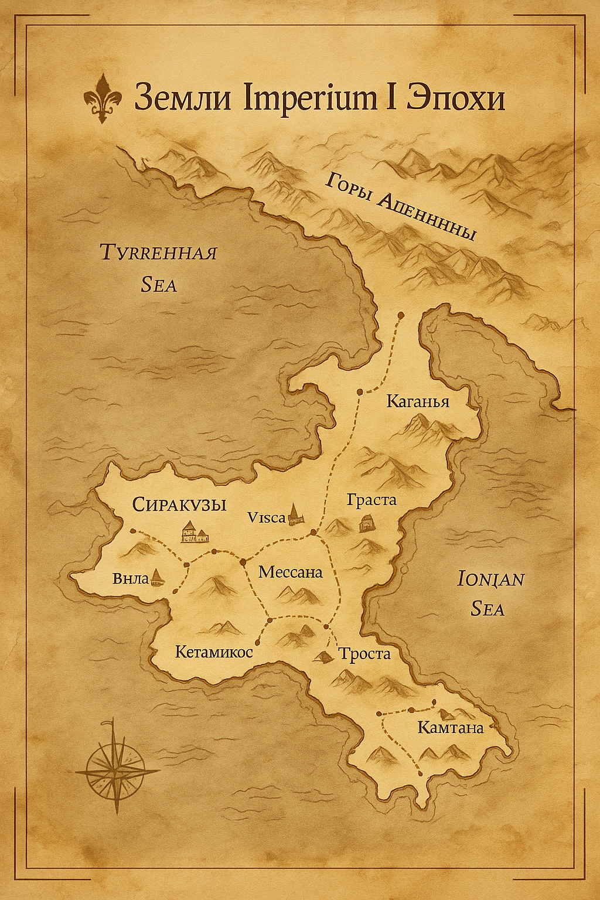

# 🏛 01. Пролог — Рождение Imperium

> «Мир Imperium создан не для победы, а для понимания.»  
> — Из хроник основателей Сиракуз

---

🌅 **Смысл проекта**  
Imperium — это живая симуляция античного мира, где время течёт непрерывно, знания распространяются волнами, люди рождаются и уходят, а вера способна менять реальность как социальная сила. Здесь игрок — не бог, а один из жителей, чья судьба вплетена в ткани истории.

🎯 **Цели**
- Реалистичные сезоны, климат и экономика.  
- Уникальные NPC: генетика, таланты, навыки, мораль, воля.  
- Собственность, право, философия, религии, империи.  
- Хроники эпох и “дух времени”.  
- Архитектура .NET + LLM-агенты, возвращающие только JSON.

📜 **Записи хрониста**  
> «Империи рождаются не из меча, а из мысли. И гибнут — тоже.»

---

📜 **Карта мира Imperium I Эпохи**
> Побережье Сиракуз и три прибрежные деревни. Торговые пути, дороги, горы и гавани античного мира.

---

