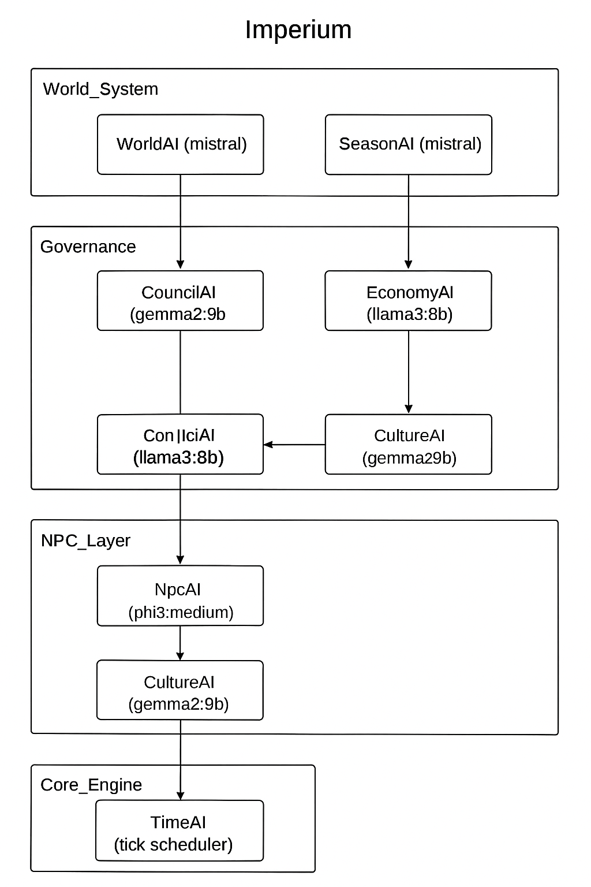

# ⚙️ 05. Архитектура AI-симуляции

## 🧱 Технологический стек
- .NET 9 (Minimal API), C# 13  
- EF Core + SQLite  
- Aspire-стиль: Api / Domain / Infrastructure / Llm / AppHost

## 🔁 Tick-Loop (порядок фаз)
1) TimeAI → 2) WorldAI → 3) SeasonAI → 4) NatureAI → 5) EconomyAI →  
6) Empire/Politics/Conflict → 7) Ownership/Property →  
8) Genetic/Talent/Trait/Skill/Perception → 9) Relationship/Family/Society →  
10) Knowledge/Innovation/Diffusion/Scholar → 11) Faith/Mythos/Philosophy/Zeitgeist →  
12) Culture/History/DeepHistory → 13) Npc/Inner/Moral/Social/Reputation → 14) EventDispatcher

## 🧩 Контракт агента
```csharp
public interface IWorldAgent
{
    string Name { get; }
    Task TickAsync(AppDb db, ILlmClient llm, CancellationToken ct);
}
```

## 📦 Ключевые модели
WorldTime, SeasonState, WeatherSnapshot, Location, Faction, Army, Character, Family, Relationship,  
NpcEssence, TalentDevelopment, Ownership, NpcMemory, EconomySnapshot, Technology, KnowledgeWave, RegionalKnowledge,  
Rumor, Deity, Building, WorldChronicle, GameEvent.

## 🤖 LLM-промпты (только JSON)
- WeatherSnapshot → `{ condition, temperatureC, windKph, precipitationMm, dayLength }`  
- NpcReply → `{ reply, moodDelta?, loyaltyDelta? }`  
- KnowledgeDiscovery → `{ name, field, effect, impact }`  
- MythosEffect → `{ omen, crowdEffect, duration }`  
- Dream → `{ symbol, meaning, action }`  
- HistorySummary → `{ summary, highlights[] }`  
- LegalDecision → `{ verdict, penalty, precedentNote }`


## ⚙️ Распределение моделей Imperium

Ниже показано, как разные LLM-модели взаимодействуют внутри симуляции Imperium.



> Каждый слой использует собственную модель Ollama или OpenAI:
> - WorldAI / SeasonAI — `mistral`
> - EconomyAI / ConflictAI — `llama3:8b`
> - CouncilAI / CultureAI — `gemma2:9b`
> - NpcAI — `phi3:medium`

## 🔔 EventDispatcher и фоновые публикации

Введён `EventDispatcher` — фоновой сервис с очередью, который принимает `GameEvent` объекты и последовательно их сохраняет и публикует (например, через SSE). Ключевая идея — избегать тяжёлых I/O внутри долгих транзакций доменной логики: агенты и сервисы собирают события во время транзакции, фиксируют изменения, коммитят, а затем помещают события в очередь для фоновой обработки.

Это повышает отказоустойчивость и производительность симуляции при интенсивных операциях (напр. массовые перераспределения владений).

## 🏛 CivilizationGenesisService

Новый сервис `CivilizationGenesisService` превращает часть племён (`tribe`) в `city_state` фракции в начале симуляции. Он:

Для надёжности добавлены интеграционные тесты: `CivilizationGenesis_IsIdempotent_OnSecondRun` и `CivilizationGenesis_CreatesValidTradeRoutesAndReserves`.


## 🛡 EmpireGenesisService

`EmpireGenesisService` развивает сильные город‑государства в ранние империи:
- выбирает 1–3 ведущих `city_state` и создаёт `empire` фракции;
- формирует армии (infantry/cavalry/archers/navy), юридический код и базовую налоговую политику;
- сохраняет `TaxPolicyJson` и помечает присоединённые города через `ParentFactionId` и `LocationId`;
- при наличии LLM генерирует короткий founding myth и добавляет его в `Rumor`.

Для надёжности добавлены интеграционные тесты: `EmpireGenesis_CreatesEmpiresAndArmies` и `EmpireGenesis_IsIdempotent_OnSecondRun`.

## 🚚 Trade routes (персистентные)

Trade routes теперь сохраняются в отдельной таблице `TradeRoutes` и связаны с владельцем `OwnerFactionId`. Это даёт возможность моделировать долгосрочные торговые каналы, взимать пошлины и учитывать их в `LogisticsAgent`.
## ⚙️ Детерминированность и тестируемость

Для некоторых операций (например, распределения остаточных минимальных единиц при равномерном разделе) добавлена возможность детерминированного рандома: интерфейс `IRandomProvider` и реализация `SeedableRandom` позволяют фиксировать seed в тестах, чтобы повторно получать одну и ту же последовательность распределения.

## 📡 Реальное время и наблюдаемость

- События и погодные снимки публикуются не только через `EventStreamService`, но и транслируются по SignalR-хабу `/hubs/events` (автореконнект включён, мок-стрим включается только при фактическом обрыве канала и выключается после успешного переподключения). SSE-эндоинты /api/events/stream и /api/weather/stream сохранены для совместимости.
- TickWorker и агенты обёрнуты OpenTelemetry `ActivitySource` (`Imperium.TickWorker`) и фиксируют статусы (`tick.started/completed/errors`, `agents.<Name>.success|timeouts|errors`), что упрощает трассировку долгих фаз.
- LLM-вызовы идут через декоратор `LlmMetricsDecorator`, который создаёт Activity `Imperium.Llm`, считает счётчики (`llm.requests/success/errors/canceled`) и записывает гистограмму `imperium_llm_duration_ms`.
- Prometheus-скрейп доступен по `/metrics`; дополнительно экспортируются гистограммы длительности тиков (`imperium_tick_duration_ms`) и агентов (`imperium_agent_duration_ms`), счётчики экономики (`imperium_economy.orders.*`), реакции NPC (`npc.replies`), логистика (`logistics.jobs.*`) и новые LLM-счётчики (`imperium_llm_*`).
- REST-срез `/api/metrics/ticks` возвращает последние измерения длительности тиков (кольцевой буфер на ~120 значений) и используется фронтэндом для визуализации спарклайна в сайдбаре.
- WorldTime: `TimeAI` теперь публикует дополнительные вычисляемые поля — `month` и `dayOfMonth` в событии `time_tick`.
- Новые Dev endpoints: `POST /api/dev/tick-now?advanceTime=true` (выполнить все агенты и дополнительно продвинуть TimeAI) и `POST /api/dev/tick-time` (прогон только TimeAI). Ответы содержат `worldTime` для удобства тестов и UI.
- События времени: `time_tick` (включая `month`/`dayOfMonth`), `day_change`, `month_change`, `year_change` — полезны для сезонных/календарных агентов и UI виджетов.

### Миграции и поддержка версии
Во время разработки добавлены миграции для новых сущностей и полей:
- `20251021120000_AddTradeRoutesAndFactionFields` — создаёт таблицу `TradeRoutes` и добавляет поля `ParentFactionId`, `TaxPolicyJson`, `LocationId` в `Factions`.
- Миграция для `Army` (создание таблицы `Army`) была добавлена локально; при необходимости временные helper-миграции могут быть удалены — важно синхронизировать записи в `__EFMigrationsHistory` с текущим набором файлов миграций, чтобы избежать конфликтов при применении.

Если при развёртывании возникают конфликты (например, «table already exists»), проверьте текущее состояние `__EFMigrationsHistory` и сопоставьте с файлами миграций в репозитории; при необходимости очистите временные записи в истории миграций только после согласования с командой и резервного копирования БД.
